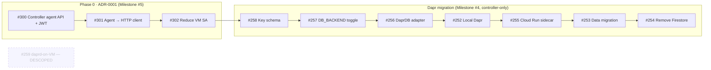

# ADR-0002: Dapr State Store Key Schema and Cloud Run Sidecar Topology

- **Status:** Accepted
- **Date:** 2026-07-06
- **Deciders:** Metio maintainers

## Context

Per [ADR-0001](0001-controller-agent-api.md), only the Controller touches the state store — the machine-agent accesses state through a Controller HTTP API. The Dapr State Management Migration (#252–259) introduces a `DaprDB` adapter so the datastore backend becomes pluggable.

This ADR documents two interlocking decisions:

1. **Key schema** — how Firestore document paths map to flat Dapr state keys.
2. **Cloud Run sidecar topology** — how `daprd` runs alongside the Controller.

## Decision Drivers

1. **Pluggability** — the key schema must work with any Dapr state store, not just Firestore.
2. **Backward compatibility** — existing data must be migratable (see #253).
3. **Zero-cost idle** — the Cloud Run topology must preserve `min_instance_count = 0`.

## Key Schema Design

### Separator

Use `:` as the key-internal separator. Dapr separates app ID from the logical key with `||`, so `:` inside the logical key never conflicts.

### Flat Key Layout

| Dapr State Key | Go Type | JSON Tagging | Notes |
|---|---|---|---|
| `status:{instanceName}` | `Status` | Add `json:"..."` alongside `firestore:"..."` | Direct mapping |
| `whitelistcfg:{instanceName}` | `WhitelistConfig` | Add `json:"..."` alongside `firestore:"..."` | Direct mapping |
| `whitelist:{instanceName}:{uuid}` | `WhitelistEntry` | Add `json:"..."` alongside `firestore:"..."` | UUID is sub-key for idempotent add/remove |
| `whitelistidx:{instanceName}` | `[]string` (UUIDs) | `json:"uuids"` | **Index key** — enables listing without Query API |
| `provisioning:{serverID}` | `ProvisioningStatus` | Add `json:"..."` alongside `firestore:"..."` | Direct mapping |
| `serverconfig:{serverID}` | `ServerConfig` | Add `json:"..."` alongside `firestore:"-"` for ID | ID reconstructed from key suffix |
| `configsnapshot:{serverID}` | `ServerConfig` | Same as `serverconfig:` | Direct mapping |
| `serverindex` | `[]string` (serverIDs) | `json:"server_ids"` | **Index key** — enables `ListServerConfigs` and `ListAllServerIDs` |
| `pulumisettings` | `PulumiSettings` | Add `json:"..."` alongside `firestore:"..."` | Singleton |

### Why No Native Query / Transaction Support

Dapr's `state.gcp.firestore` component operates in **Datastore mode** and supports only the [basic CRUD API](https://docs.dapr.io/reference/components-reference/supported-state-stores/setup-gcp-firestore/):
- `SaveState`, `GetState`, `DeleteState`, `GetBulkState`, `DeleteBulkState`
- **No** `ExecuteStateTransaction` — no multi-document atomicity.
- **No** `QueryState` — no server-side filtering or pagination.

This means `DaprDB` uses **index keys** for list operations (finding all children of a parent). All 24 methods of the `db.DB` interface (`internal/db/db.go:12-37`) have a clear implementation strategy:

| Method category | Dapr strategy |
|---|---|
| Single-key CRUD (Status, WhitelistConfig, ServerConfig, ProvisioningStatus, PulumiSettings, ConfigSnapshot) | `SaveState` / `GetState` / `DeleteState` on the flat key |
| List (GetWhitelistEntries, ListServerConfigs, ListAllServerIDs) | Read index key → `GetBulkState` on each member key |
| Whitelist mutation (Add/Remove/Set) | Read-modify-write `whitelistidx:` + per-entry `SaveState`/`DeleteState` |
| Provisioning steps (AddProvisioningStep, CompleteProvisioning, FailProvisioning) | Read `provisioning:` → mutate in memory → `SaveState` back. Non-atomic: acceptable for single-user control plane. |
| Multi-operation (CreateServerConfig appends index, DeleteServerConfig removes from index, SetWhitelistEntries replaces index) | Read-modify-write on `serverindex` or `whitelistidx:` + per-item writes. Non-atomic; document a reconcile/repair path for rare index drift. |

### ServerConfig.ID Recovery

`ServerConfig.ID` is tagged `firestore:"-"` — it is derived from the Firestore document ID and not stored in the document body. For the Dapr adapter, the same approach applies:

1. **On write (`SaveState`):** `ServerConfig.ID` is tagged `json:"-"` so it is omitted from the serialized JSON blob. The Dapr key `serverconfig:{serverID}` already encodes the identity.
2. **On read (`GetState`):** Parse `{serverID}` from the Dapr key suffix (e.g., extract `"myserver"` from `"serverconfig:myserver"`) and set `ServerConfig.ID` after deserialization.
3. **On bulk read (`GetBulkState`):** Same suffix-parsing applied to each key in the result set.

This mirrors the current pattern at `internal/db/crud.go:438` (`config.ID = doc.GetID()`). The Dapr adapter abstracts this in a helper method, e.g.:

```go
func parseServerConfigID(key string) string {
    // key = "serverconfig:{serverID}" — extract serverID
    parts := strings.SplitN(key, ":", 2)
    if len(parts) == 2 {
        return parts[1]
    }
    return ""
}
```

### Struct Tag Changes

Data models currently carry only `firestore:"..."` tags. Dapr state stores serialize to JSON, so every struct field needs a `json:"..."` tag:

```go
type Status struct {
    Players              Players     `firestore:"players"              json:"players"`
    Timestamp            time.Time   `firestore:"timestamp"            json:"timestamp"`
    // ...
}
```

ServerConfig.ID (`firestore:"-"`) is reconstructed from the key suffix on read and omitted on write.

String enum types (ProvisioningState, ProvisioningOperation, ServerState) should implement `json.Marshaler`/`json.Unmarshaler` or use a string-backed enum for portable serialization.

### Existing Firestore Document Path → Dapr Key Mapping

| Firestore Path | Dapr State Key |
|---|---|
| `instances/{name}/data/status` | `status:{name}` |
| `instances/{name}/data/whitelist` | `whitelistcfg:{name}` |
| `instances/{name}/whitelist/{uuid}` | `whitelist:{name}:{uuid}` |
| `servers/{id}` (marker doc) | (not migrated; replaced by `serverindex`) |
| `servers/{id}/data/config` | `serverconfig:{id}` |
| `servers/{id}/data/provisioning` | `provisioning:{id}` |
| `servers/{id}/data/config_previous` | `configsnapshot:{id}` |
| `settings/pulumi` | `pulumisettings` |

## Cloud Run Sidecar Topology

### Architecture

The Controller Cloud Run service runs **two containers** in a single pod:

1. **`controller`** — Go binary, listens on `PORT` (Cloud Run default, typically 8080).
2. **`daprd`** — [official Dapr sidecar image](https://docs.dapr.io/operations/hosting/serverless/cloudrun/), listens on `3500` (HTTP) and `50001` (gRPC). The controller connects to `localhost:50001`.

Only the controller container receives ingress traffic. daprd is internal-only.

### Component File Delivery

Cloud Run supports mounting **Secret Manager secrets as volumes**. The `dapr/components/` directory is mounted from a secret containing the component YAML file:

```yaml
# statestore.yaml — stored as a Secret Manager secret
apiVersion: dapr.io/v1alpha1
kind: Component
metadata:
  name: statestore
spec:
  type: state.gcp.firestore
  version: v1
  metadata:
    - name: entity_kind
      value: "DaprState"
    - name: firestore_database
      value: "(env)-(region)-metio-db-datastore"
    - name: type
      value: "datastore"
```

daprd auto-loads component files from its `--components-path` (mounted volume).

### Firestore Database

The GCP Firestore Dapr component requires **Datastore mode** (`type: "datastore"`) with the `DaprState` entity kind. A **separate Firestore database** in Datastore mode must be created — the existing database is `FIRESTORE_NATIVE` mode and cannot be used.

- Database ID: `(env)-(region)-metio-db-datastore` (e.g., `production-europe-west3-metio-db-datastore`)
- Created via OpenTofu (`google_firestore_database` resource with `type = "DATASTORE_MODE"`)

The existing Native-mode database remains untouched until #254 removes it.

### Health Checks and Probes

- **Controller `GET /healthz`**: returns 200 only when the daprd gRPC connection is healthy. This ensures the pod is considered ready only when both containers are operational.
- **Cloud Run startup probe**: 60s initial delay, `/healthz` on the controller port.
- **Cloud Run liveness probe**: `/healthz` every 30s.

### Resource Allocation

- Controller: unchanged (current spec — preserve existing CPU/memory).
- daprd: 0.1 vCPU / 128 MiB (lightweight sidecar; scales with the controller).
- Total within Cloud Run's per-container-pod resource limits.

### Data Migration Strategy

Data migration from Firestore (Native mode) to the Dapr Datastore-mode database is tracked by #253 and executed as a one-off batch job (not a controller deployment). The strategy:

1. **Deterministic key mapping**: Each Dapr key is a deterministic function of the source Firestore path per the table in [Existing Firestore Document Path → Dapr Key Mapping](#existing-firestore-document-path--dapr-key-mapping). A migration script reads each Firestore document, constructs the target Dapr key, and writes via the Dapr State API.

2. **Index reconstruction**: The `serverindex` and `whitelistidx:{name}` keys have no Firestore equivalent — they are new index structures. After migrating all data documents, the script reads all `serverconfig:{id}` keys and `whitelist:{name}:{uuid}` keys to build and write the index keys.

3. **Data integrity**: After migration, the script verifies that every index entry (in `serverindex`) has a corresponding data key (`serverconfig:{id}`), and vice versa. Mismatches are logged and flagged for manual review.

4. **Rollback**: The Firestore-native database is kept until #254 explicitly removes it. A rollback is simply a matter of switching `DB_BACKEND` to `firestore` and re-deploying. Data in the Datastore-mode database is left in place for a later re-migration attempt.

5. **No downtime**: The migration runs offline (controller is not serving during migration). The Dapr adapter (`DaprDB`) does not need to read from the Native-mode database — it only reads from the Datastore-mode database once `DB_BACKEND=dapr` is toggled.

### Scale-to-Zero

`min_instance_count = 0` is preserved. On cold start Cloud Run boots both containers simultaneously. The daprd startup time (~1-2s) adds marginally to cold-start latency but is negligible for the 30s agent poll cycle.

## Sequencing with the Dapr Initiative (#252–259)

The implementation order respects the dependency chain:



- Phase 0 (#300 → #301 → #302) gates the entire Dapr migration.
- #258 (key schema) gates all other Dapr work — must be done first.
- #259 is descoped: `daprd`-on-VM is obviated by ADR-0001; the controller-sidecar work is covered by #255 and the `dapr/go-sdk` dependency by #256.

## Consequences

### Positive

- All 24 `db.DB` methods have a known Dapr implementation path despite the no-query/no-txn constraint.
- Flat key schema works with any Dapr state store, not just Firestore.
- Cloud Run sidecar topology preserves zero-cost idle.
- Existing data can be migrated algorithmically (flat key is a deterministic function of the Firestore path).

### Negative / Tradeoffs

- **No atomic multi-step operations**: index keys and child records are written non-atomically. Risk of index drift (orphaned entries or missing references). Mitigation: document a reconcile/repair CLI command, acceptable for single-user control plane.
- **`:` as separator** is arbitrary but conflicts with Dapr's `||` only — if a future store uses `:` as a separator this will need escaping. Considered but rejected `__` and `/` as alternatives.
- **Dual Firestore databases** during the migration window: Native + Datastore-mode. The user pays for two databases until #254 removes the Native one.
- **Two Cloud Run containers** increase cold-start time slightly.

## Related

- ADR-0001 — Controller-Mediated Agent State Access (gates this work)
- Issues: #252–259 (Dapr State Management Migration), #259 (descoped)
